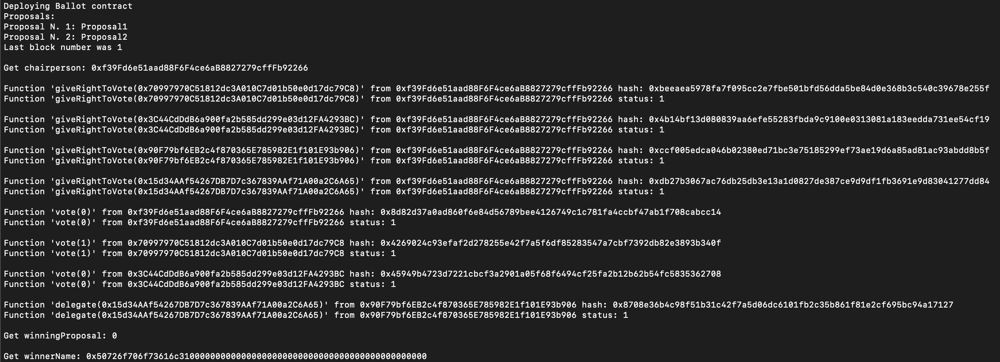

# Ballot

## To run the script to get report of transactions

- In your command line execute the script:
``` 
npx ts-node ./scripts/ReportVotes.ts Proposal1 Proposal2
```



## To run the scripts

- Run report of votes
``` 
npx ts-node ./scripts/ReportVotes.ts Proposal1 Proposal2
```

- Deploy with Hardhat
``` 
npx ts-node ./scripts/DeployWithHardhat.ts Proposal1 Proposal2
```

- Deploy with Ethers
```
npx ts-node ./scripts/DeployWithEthers.ts Proposal1 Proposal2
``````

# Sample Hardhat Project

This project demonstrates a basic Hardhat use case. It comes with a sample contract, a test for that contract, and a script that deploys that contract.

Try running some of the following tasks:

```shell
npx hardhat help
npx hardhat test
REPORT_GAS=true npx hardhat test
npx hardhat node
npx hardhat run scripts/deploy.ts
```
